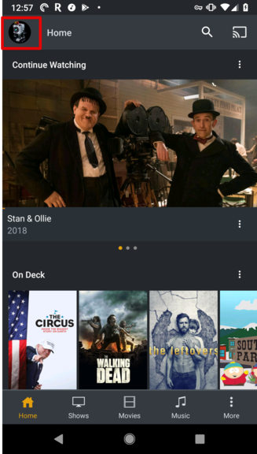
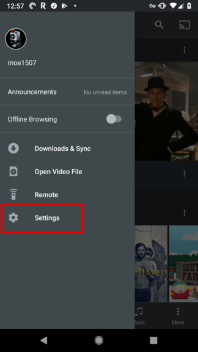
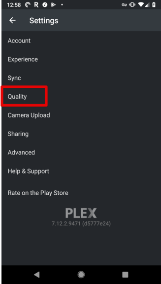
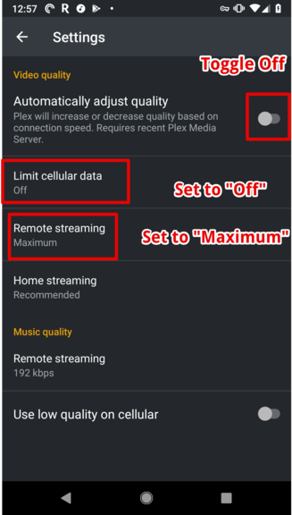
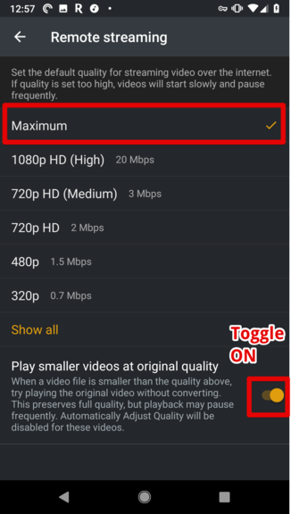
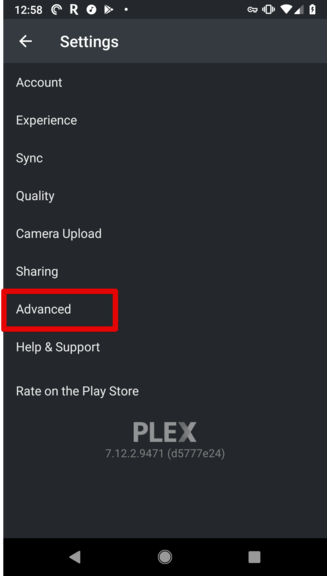
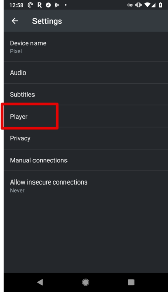
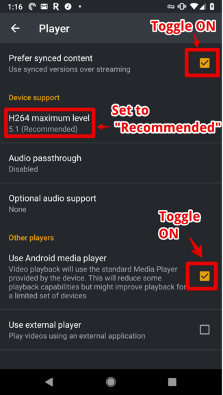
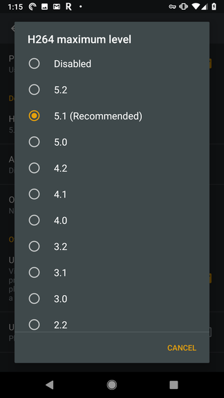

# Adjusting Video Quality Settings
> Plex for Android

### Introduction
This guide will walk through the steps to adjust the settings to **maximize playback compatibility** and **quality**. 

The goal of this guide is to reduce the chances that the stream will be converted to a lower quality by modifying the default settings in the application.

### What happens when I press Play?

When a Plex application plays a video it sends a request to the Plex Server with information that indicates what formats, resolutions, and bandwidth is available to play the video. 

The Plex Server then makes a decision whether to stream the video **Direct Play** to the device or **Transcode** the video.

### Direct Play
If the video file requested is compatible with the device and the internet connection is fast enough; the file will be streamed directly to the player at the highest quality, without any conversions to a smaller size or different format. 

This method of streaming will provide the **highest quality** and **best experience** as the video does not need to be converted to meet the needs of the player.

### Transcoding

If the internet connection is not fast enough or the player does not indicate that it can play the file; The Plex Server will transcode (convert) and stream the file to the player on-demand. 

Anytime a video is converted it looses quality, and depending on speed of the connection the quality may be significantly reduced. Converting a video requires processing power from the Plex Server, which has it's limits (~4 transcodes).

##### Example: Internet speed is not fast enough

The user has a `10 Mbit/s (Megabits/sec)` internet connection and requests a 1080p video which is `9000 MB (Megabytes)` and `90 minutes (5400 sec)` in length. 

We can determine the bandwidth required to stream this movie with some quick math. 

`9000 Megabytes` / `5400 seconds` = `1.66 MB/s (Megabytes/sec)`

`1 Megabyte` is made up of `8 Megabits`

`1.66 Megabytes` * `8 Megabits` = `13.2 Mbit/s (Megabits/sec)` of bandwidth is required to stream this video

`13.2 Mbit/s` is greater than the internet speed connection at `10 Mbit/s`.

Therefore the Plex Server will need to **Transcode** the video to a lower bitrate to be able to stream the video without buffering. The quality of the video will be reduced.

##### WARNING

If there are too many streams being Transcoded the overall quality and experience of Plex will be degraded for all users as CPU power is a finite resource (~4 transcodes).

### Adjusting settings for Maximum Compatibility and Quality

> 1-2 minute read

#### 1. Open Navigation Menu
> Home

In the top left of the screen...click the circular icon to open the **Left Navigation Menu**. 

#### 2. Open Settings
> Home > Menu

Tap **Settings**

#### 3. Open Quality Settings
> Home > Menu > Settings 

Tap **Quality**

#### 4. Adjust Quality Settings
> Home > Menu > Settings > Quality

1. Toggle `Automatically adjust quality` to **OFF**
2. Set `Limit cellular data` to **OFF**
3. Set `Remote streaming` to **Maximum** (See below)

#### 5. Adjust Remote Streaming Settings
> Home > Menu > Settings > Quality > Remote Streaming

1. Tapping `Remote streaming` will show a list of resolutions to stream.  
2. Set Remote streaming bandwidth to **Maximum**

#### 6. Open Advanced Settings
> Home > Menu > Settings
1. Tap the **back button** in the top left until you return to the settings menu.
2. Tap **Advanced**

#### 7. Open Advanced Player Settings
> Home > Menu > Settings > Advanced

Tap **Player**

#### 8. Adjust Advanced Player Settings
> Home > Menu > Settings > Advanced > Player

1. Toggle `Prefer synced content` to **ON**
2. Set `h264 maximum level` to the **Recommended** option. It may not be 5.1 as pictured. It could be lower or higher. (See below)
3. Toggle `Use Android media player` to **ON**

#### 9. Adjust H264 Maximum Level
> Home > Menu > Settings > Advanced > Player > H264 Maximum Level

Set `h264 maximum level` to the **Recommended** option. It may not be 5.1 as pictured. It could be lower or higher.

#### 10. Finished!
> Home

We have now optimized your settings for **maximum playback compatibility** at the **highest quality**!

